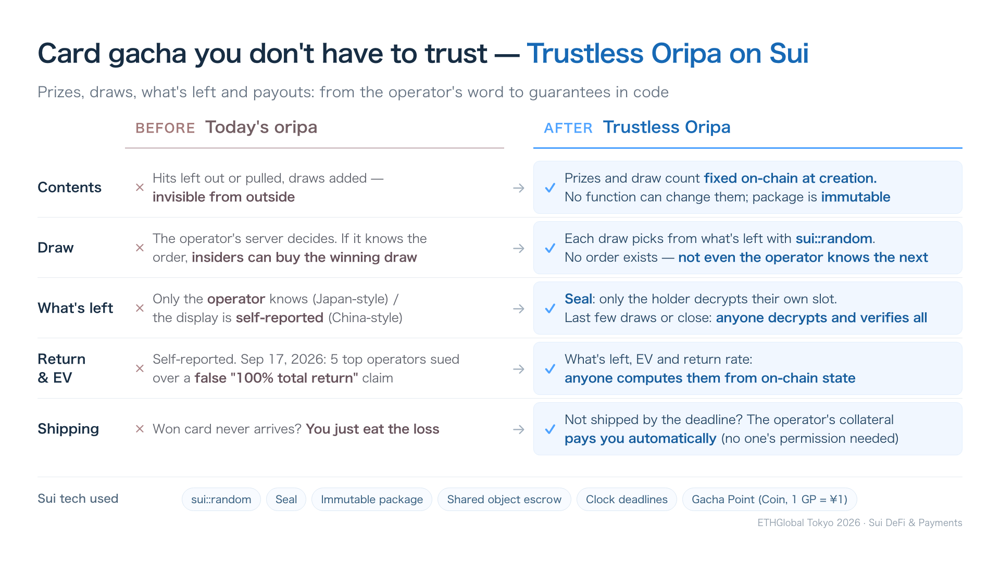
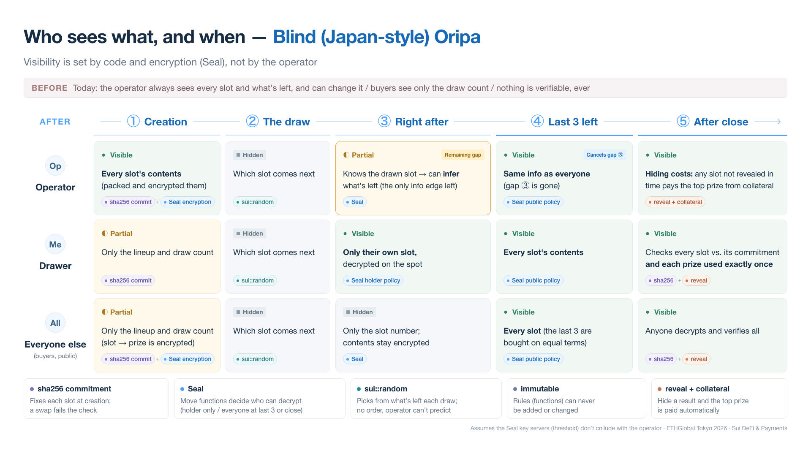
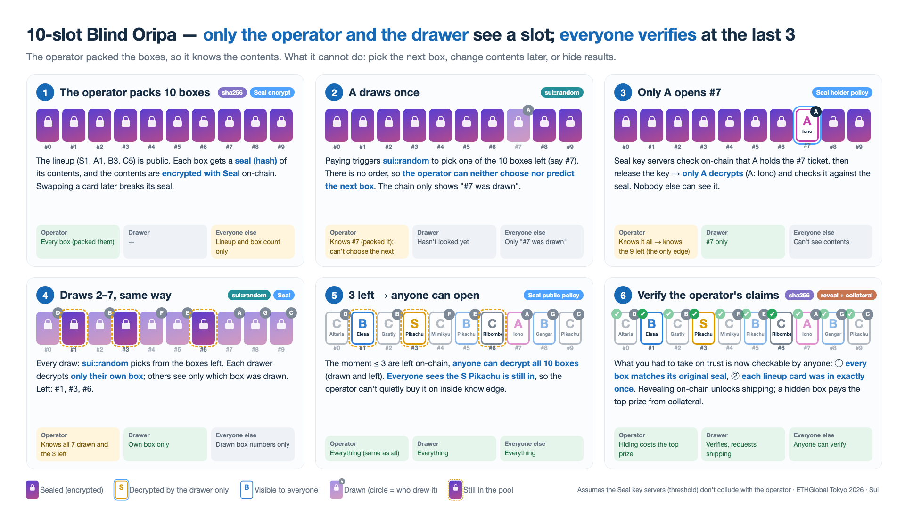
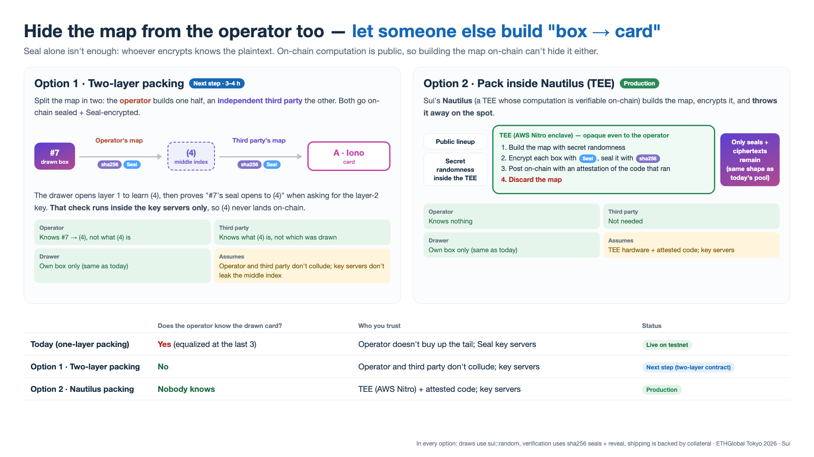

# Trustless Oripa — a card gacha you don't have to trust

**ETHGlobal Tokyo 2026 · Sui (DeFi & Payments)**

**Live demo:** https://trustless-oripa.pages.dev (Sui testnet) · **Slides:** https://trustless-oripa.pages.dev/docs/



## The problem

*Oripa* (オリパ, "original pack") is Japan's online trading-card gacha. An operator
fills a pool with N draws and a fixed prize list (a few PSA-graded jackpots, many
commons) and sells the draws one by one. Buyers usually see only how many draws are left.

Every part of it runs on the operator's word:

- **Contents**: nobody outside can check that the jackpots are in the pool, that they
  weren't pulled out, or that extra draws weren't added before the "last one".
- **The draw**: the operator's server decides. Whoever knows the order can let insiders
  buy the winning draw.
- **What's left**: only the operator knows (Japan-style). Where the remaining prizes are
  shown (Chinese ichiban-kuji style), the display is self-reported.
- **Return rate and EV**: self-reported. On **Sept 17, 2026, 38 buyers sued five of the
  largest Japanese oripa operators** over a false "100% total return" claim.
- **Shipping**: if a won card never arrives, the buyer just eats the loss.

Overseas, on-chain gacha (Courtyard, Collector Crypt, Phygitals) grew to hundreds of
millions of dollars a month, but users still trust the operator's pool contents and
randomness keys.

## The solution: a Blind Oripa on Sui

We keep the Japanese format, where buyers see only the draw count, and make every
step verifiable. What the operator cannot do any more:

- choose or predict which box comes next;
- change what is in a box after the pool is created;
- hide results or skip shipping without paying for it.



Step by step, with a 10-box example:



1. **Pack.** The prize lineup is public. Each box stores a **sha256 commitment**
   `sha256(slot || prize || salt)` and a **Seal ciphertext** of `(prize, salt)` under
   identity `pool_id || slot`. The package has no function to change them.
2. **Draw.** Paying calls `draw`, which picks a uniformly random *remaining box* with
   **`sui::random`**. There is no pre-shuffled order, so nobody can sell or leak "the
   winning draw number". The event only shows the box number.
3. **Open.** The drawer's wallet asks the **Seal** key servers for the box's key. They
   release it only if `seal_approve_holder` passes on-chain, i.e. the caller holds that
   box's ticket. The browser decrypts it and checks it against the commitment.
4. **Last 3 left (or sale closed).** `seal_approve_public` starts passing, so **anyone
   can decrypt every box**, drawn or not. The operator's only information edge
   (knowing what is left) disappears before the tail is sold.
5. **Verify.** Anyone checks that every box matches its commitment and that **each
   lineup prize was in exactly once**. `reveal` records this on-chain and unlocks
   shipping.
6. **Shipping is guaranteed by collateral.** If a requested card is not marked shipped
   before the deadline, the holder claims its value from the operator's locked
   collateral. A box left unrevealed after close pays the **top prize**, so hiding a
   result is never cheaper than honoring it.

## How we use the Sui stack

| Sui feature | Where | What it guarantees |
|---|---|---|
| **`sui::random`** (validator threshold randomness, object `0x8`) | `blind::draw` (private `entry`) | Each draw picks from what's left; nobody, including the operator, can choose or predict it |
| **Seal** (threshold IBE with Move access policies) | `blind::seal_approve_holder` / `seal_approve_public`, `frontend/src/lib/blind.ts`, `scripts/seed-blind.ts` | Only the ticket holder can read a box during the sale; everyone can read everything at the public tail or after close |
| **Move objects**: shared `BlindPool`, owned `BlindPull` tickets (transferable), shared `BlindRedemption` | `move/oripa/sources/blind.move` | State anyone can read and a claim ticket per draw |
| **Immutable package**: the UpgradeCap goes to `0x2::package::make_immutable` in the publish PTB | `scripts/deploy.ts` | No function can ever be added that touches existing pools |
| **Coin via `coin_registry`**: Gacha Point (GP, 0 decimals, 1 GP = ¥1) with a shared `PointBank` | `move/oripa/sources/gacha_point.move` | Prices and prize values read as yen; free to charge on testnet (production would sell GP for yen / JPYC / USDC; pools are coin-generic) |
| **`Balance<T>` escrow + `Clock` deadlines** | `blind::request_redeem / mark_shipped / claim_collateral / claim_unrevealed` | Sales and collateral are held by the pool; payouts happen automatically when a deadline passes |
| **PTBs** | `coinWithBalance` + `draw`; charge + create pool; chunked `add_slots` + `seal_slots` | Pay and draw in one transaction; build a 100-box pool in two |
| **dapp-kit v2 + gRPC client, Seal SDK** | `frontend/` | Wallet connect (Slush or burner), BCS-decoded objects and events, in-browser Seal decryption |

### Security details

- `draw` is a **private `entry`** function taking `&Random`. It can't be wrapped by
  another module, and Sui rejects PTB commands after it other than transfers, so a
  caller can't look at the result and abort.
- **Constant gas across outcomes.** A draw only moves a `u64` slot id (`swap_remove`),
  so there is no "set the gas budget so only the jackpot path succeeds" attack.
- The operator can't front-run a collateral claim (`mark_shipped` aborts after the
  deadline). Collateral unlocks only after close, two windows, every drawn box
  revealed, and nothing left unshipped.
- **37 Move unit tests** (`sui move test`) cover draws, both Seal policies, commitment
  and lineup checks, penalties and collateral.

### What is still trusted, and what comes next

- The Seal key servers (a threshold committee) must not collude with the operator.
- The physical cards must exist and match their PSA certs. The demo uses placeholder
  certs.
- The operator packed the boxes, so it knows what each box holds. The public tail
  cancels that edge before the end. The next steps remove it entirely:



## Try it

1. Open https://trustless-oripa.pages.dev and connect a wallet: Slush on testnet, or the
   in-page burner wallet.
2. Get testnet SUI for gas at https://faucet.sui.io (the Charge panel links it with your
   address).
3. Press **Charge** for free Gacha Points, then **BLIND DRAW**. Sign once for Seal and
   you see your card; nobody else can.
4. Switch to the **6-slot pool**. It is already in its public tail: press *Decrypt all
   slots with Seal* to verify every commitment and the lineup.

## Deployed (Sui testnet)

| | ID |
|---|---|
| Package (pool + blind + gacha_point), immutable | `0xb086a10503300345c5192fcffcf72226661c9afed7fe199383f4dc0be166698a` |
| Gacha Point coin | `0xb086…698a::gacha_point::GACHA_POINT` |
| PointBank | `0x600366fa26e69cb1351765130f5758739ee9c24fdbda3bbee419644e62c6cce0` |
| Blind pool, 100 boxes | `0xf9f21164eb34944027a95c73e4b736ccd0e9ef641a0a6582621a88aabcf828d5` |
| Blind pool, 6 boxes (public tail) | `0xc8335abf4d4791db9ee914114c6d9f49c14b2b4db3df7b4fe4a54e5073937167` |
| Seal key server | Mysten testnet committee `0xb012378c…1e98` (via aggregator) |

The package also contains `pool.move`, an open (ichiban-kuji style) instant pool and a
batch-break mode that settles all spots with one shuffle at a deadline. They are tested
but not shown in the demo UI.

## Repository

```
move/oripa/sources/blind.move        Blind oripa (commitments, Seal policies, reveal, collateral)
move/oripa/sources/gacha_point.move  Gacha Point coin + PointBank
move/oripa/sources/pool.move         Open and batch modes
move/oripa/tests/                    37 unit tests
scripts/export_cards.py              builds the lineup from psa-data (SNKRDUNK prices + images)
scripts/deploy.ts                    publish + make_immutable in one tx
scripts/seed-blind.ts                commit + Seal-encrypt every box, then seal the pool
frontend/                            Vite + React + dapp-kit v2 (Seal decryption in the browser)
docs/slide/                          the slides above (English and Japanese)
docs/plan.md                         the implementation plan used to build this
```

```bash
make test                                   # Move unit tests
python3 scripts/export_cards.py --plan 100 --spec-out scripts/pool_spec_100.json   # needs ../psa-data
make wallet && make deploy                  # throwaway testnet key in .sui/, publish immutable
npx tsx scripts/seed-blind.ts --spec scripts/pool_spec_100.json --lineup all --count 100 --hours 168
make dev                                    # http://localhost:5173 (Seal needs https or localhost)
```

## Data and AI disclosure

- Card images and market prices come from SNKRDUNK, collected by the author's separate
  `psa-data` project, and are used only for this hackathon demo. The images are not
  committed to this repository.
- This project was built with **Claude Code** (and Codex for two slide drafts). The AI
  wrote the Move package and tests, the scripts, the frontend, the slides and this
  README under the author's direction. The idea, market framing, design decisions and
  review are the author's. The guiding plan is in `docs/plan.md`.
